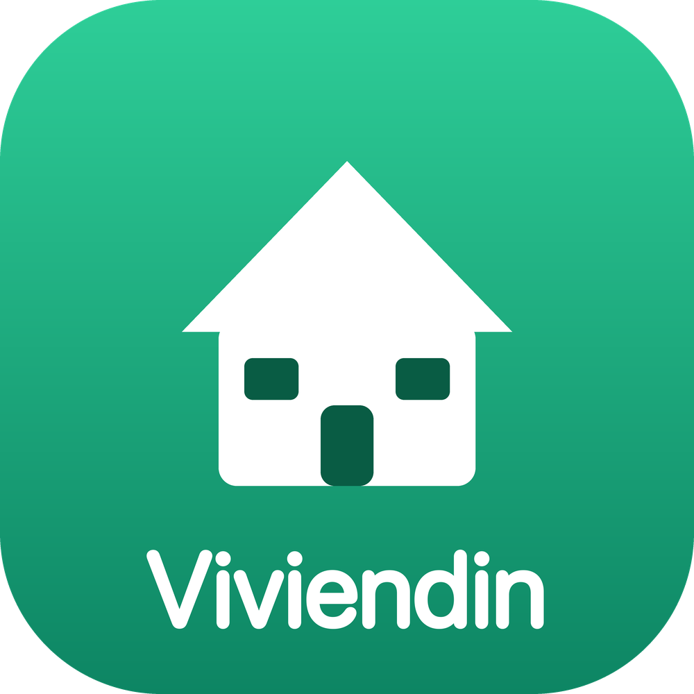

<div align="center">



# Viviendin

**Broker inmobiliario de vivienda nueva.**

Platanus Build Night — Ciudad de México · Hacker: [Andrés Tavera Mihailide (@ATaveraMi)](https://github.com/ATaveraMi)

</div>

---

## Qué es

**Viviendin** es un registro centralizado de vivienda nueva en México, alimentado desde los
**sitios propios de las desarrolladoras** (extracción con LLM), más un **agente de WhatsApp**
que entiende qué busca un comprador, le muestra **desarrollos reales** que cumplen sus criterios
(zona, presupuesto, recámaras, tipo, crédito) y captura un **lead calificado** con fecha de visita.

Operamos como **broker**: el agente NO contacta a la desarrolladora. Al cerrar, entrega el lead a
nuestro equipo —por correo— con el contacto de la desarrolladora y el **mensaje ya redactado**
para concretar la visita y cobrar comisión.

## Cómo funciona

```
Desarrolladoras (sitios propios)                     Comprador (WhatsApp)
        │  scraper (fetch + Gemini Flash)                    │  Kapso (WhatsApp Cloud API)
        ▼                                                    ▼
   ┌──────────────────────── Supabase (Postgres) ───────────────────────┐
   │  developers → developments → models           leads                │
   └────────────────────────────────────────────────────────────────────┘
        ▲ escribe inventario                          ▲ lee inventario / escribe leads
        │                                             │
   db/load_to_supabase.py                      Agente PydanticAI (Gemini)
                                                 ├─ entiende y perfila al comprador
                                                 ├─ 7 tools (búsqueda, panorama, detalle…)
                                                 └─ create_lead → Supabase + correo al equipo
```

- **Inventario:** el scraper recorre la lista de desarrolladoras, extrae con Gemini un JSON con
  schema fijo y lo sube a Supabase. El agente lee de ahí (no inventa: solo ofrece lo que existe).
- **Agente:** conversacional en español de México, honesto con ubicación/tipo/zona, propone
  alternativas cercanas con sentido y nunca alucina desarrollos, zonas ni precios.
- **Handoff:** al agendar pide nombre (obligatorio) + desarrollo + modelo + fecha tentativa, y
  manda un correo con el resumen, **a quién escribir** y el **mensaje listo para reenviar**.

### Tools del agente
`find_by_developer` · `inventory_overview` · `list_areas` · `search_inventory` ·
`get_development_detail` · `get_more_info` (entra al sitio en vivo) · `create_lead`

## Stack

Python · **PydanticAI + Gemini** (agente) · **Gemini Flash** (extracción) · **Supabase/Postgres**
(inventario + leads) · **Kapso** (WhatsApp Cloud API) · **FastAPI** (webhook) · SMTP (correo del lead).

## Cómo correrlo

```bash
# 1. Entorno
python -m venv .venv && source .venv/bin/activate
pip install -r requirements.txt
cp .env.example .env          # llena GEMINI_API_KEY, SUPABASE_DB_URL, KAPSO_*, SMTP_*

# 2. Inventario → Supabase
python -m db.load_to_supabase --init                 # crea tablas + carga data/scraped.json
python -m db.load_to_supabase --input data/seed.json # + el seed (demo CDMX/Querétaro)
python -m scraper.run --limit 30                     # (opcional) scrapear más sitios

# 3. Probar el agente en local (sin WhatsApp)
python -m agent.run_simulator    # REPL: escribes como comprador, el agente responde

# 4. Producción (webhook de WhatsApp vía Kapso)
uvicorn agent.app:app --port 8000
#   expón con ngrok y registra el webhook en Kapso → <url>/webhooks/kapso
#   verifica <url>/health
```

> Sin `SUPABASE_DB_URL` el agente cae a `data/seed.json` local. Deploy listo en `render.yaml`.

## Estructura

| Ruta | Qué es |
|------|--------|
| `agent/` | Agente PydanticAI (modelos, repo, tools, conversación, app FastAPI, simulador) |
| `scraper/` | Extracción de inventario (fetch + Gemini, pipeline de 2 fases) |
| `channel/` | Capa de canal WhatsApp (Kapso + simulador) y notificación/correo del lead |
| `db/` | `schema.sql`, loader a Supabase y backend de datos del agente |
| `data/` | `seed.json` (demo), `desarrolladoras.txt` (lista de sitios) |
| `PLAN.md` · `DATA_MODEL.md` | Alcance/negocio · contrato de datos |

## Deploy (Build Night)

El repo de la organización no se puede conectar a Render/Vercel. El código se espeja a un repo
personal ([Rialtor/viviendin](https://github.com/Rialtor/viviendin)) y el deploy corre desde ahí;
los commits quedan mirrored aquí para evaluación.
